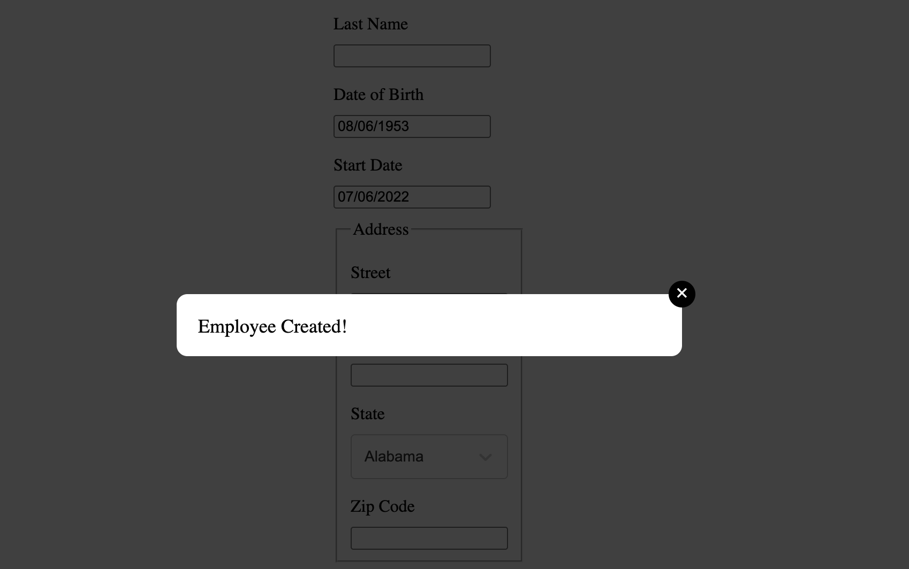

# @jbketele/hrnet-modal

**Composant React de fenêtre modale** utilisé dans le projet HRNet, conçu pour remplacer un plugin jQuery.  
Ce composant est réutilisable et facilement intégrable dans tout projet React.

---

## 📦 Prérequis

- Node.js >= 18
- npm >= 9
- React 17, 18 ou 19
- Éditeur de code recommandé : VS Code

---

## 🚀 Installation

```bash
npm install @jbketele/hrnet-modal
```

## 💡 Utilisation de base

Voici un exemple simple d'intégration du composant dans une application React :

```jsx
import { useState } from 'react';
import Modal from '@jbketele/hrnet-modal';

function App() {
  const [isModalOpen, setIsModalOpen] = useState(false);

  return (
    <div>
      <button onClick={() => setIsModalOpen(true)}>Créer un employé</button>
      
      <Modal 
        isOpen={isModalOpen} 
        onClose={() => setIsModalOpen(false)} 
      />
    </div>
  );
}
````


